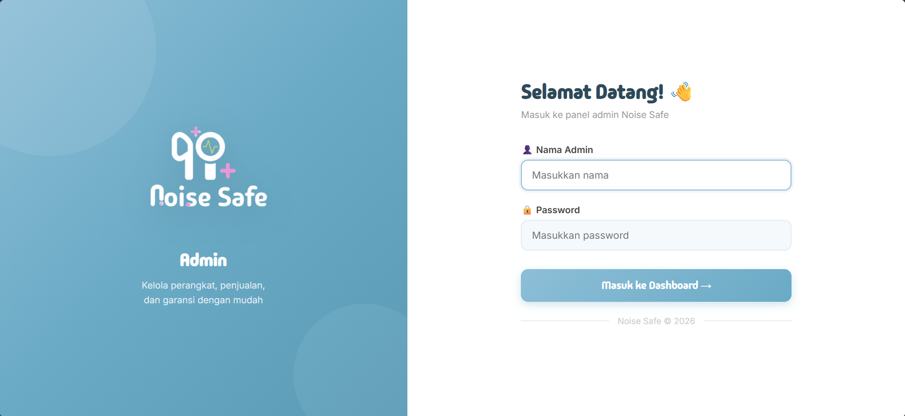
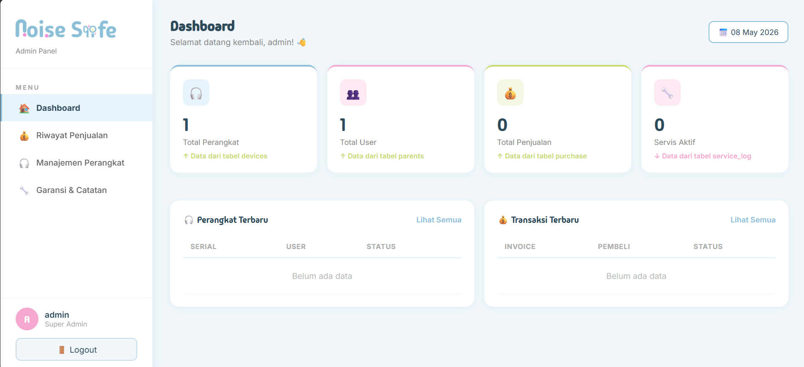
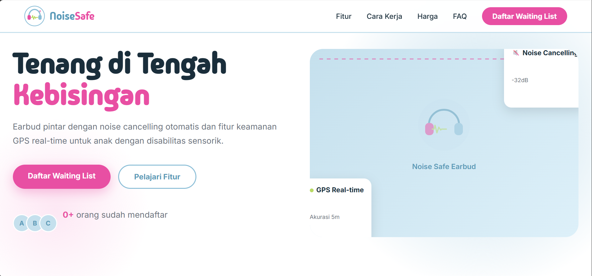

# 🌐 Pilihan Bahasa / Language Options:
[English](README.md) | **Bahasa Indonesia**

---

# Noise Safe Admin Panel (Panel Kontrol Admin IoT)

Dasbor administrasi berbasis **Framework Laravel** yang dikembangkan khusus untuk mengelola operasional perangkat keras IoT pintar (Smart Earbud), memantau aktivitas perangkat secara *real-time*, serta mendokumentasikan riwayat klaim garansi dan pemeliharaan produk.

# Ringkasan Proyek (Overview)

Noise Safe adalah proyek inovasi berbasis teknologi IoT terintegrasi yang dirancang untuk membantu penderita hiperakusis (sensitivitas berlebih terhadap suara keras) melalui perangkat *earbud* penekan bising pintar.

Ekosistem proyek Noise Safe dibagi menjadi 3 pilar teknologi utama:
* **Sistem Perangkat Keras IoT:** (Modul sensor dan micro-controller pada earbud).
* **Aplikasi Seluler (Mobile App):** Kontrol personal pengguna.
* **Panel Kontrol Admin Web (Web Admin Panel):** Pusat manajemen bisnis dan perangkat keras.

Repositori ini berfokus penuh pada arsitektur **Panel Kontrol Admin Web**. 

Sistem ini berfungsi sebagai pusat kendali bagi administrator perusahaan untuk memantau status operasional *earbud* aktif di lapangan, melacak data riwayat kepemilikan konsumen, serta mengelola log pemeliharaan unit yang rusak. Saat ini, sistem web telah berhasil diintegrasikan dengan modul perangkat keras IoT secara fungsional.

---

# Fitur Utama

## 🔌 Manajemen Perangkat IoT (Real-Time Monitoring)
Sistem mampu mengawasi siklus hidup perangkat *earbud* pintar yang terdaftar dalam ekosistem IoT secara otomatis, dengan kemampuan:
* Menampilkan katalog pangkalan data seluruh unit earbud yang aktif.
* Memantau status konektivitas perangkat (*Active / Inactive*).
* Mendeteksi anomali kondisi perangkat secara dini.
* Otomatisasi pembaruan data status di dasbor berdasarkan pengiriman paket data dari modul IoT hardware.

## 📈 Manajemen Riwayat Penjualan & Kepemilikan
Menyimpan dan mengolah data transaksi pelanggan untuk memetakan kepemilikan aset unit produk, mencakup informasi:
* Identitas lengkap Pelanggan.
* Nomor Seri & Tipe Perangkat yang dibeli.
* Tanggal Transaksi & Batas Waktu Validitas Garansi Resmi.
Fitur ini mempermudah admin dalam melakukan validasi sebelum memproses klaim servis.

## 🛠️ Log Garansi & Catatan Pemeliharaan Perangkat (Service Tracking)
Modul pelacakan perbaikan unit earbud yang masuk ke pusat servis, mencakup pelaporan:
* Deskripsi detail kerusakan perangkat keras.
* Catatan teknis tindakan perbaikan oleh teknisi.
* Validasi status jaminan (Apakah perbaikan tercover garansi gratis atau berbayar).
* Pembaruan status penanganan unit (*Pending / On Progress / Completed*).
* Rekam medis riwayat servis berkala per unit perangkat keras.

## 🔒 Autentikasi Admin & Proteksi Keamanan
Sistem login berlapis untuk mencegah serangan siber otomatis (bot bruto) dengan mengintegrasikan validasi **CAPTCHA** pada gerbang masuk admin.

---

# Teknologi yang Digunakan

* **Framework Backend:** Laravel (PHP)
* **Pangkalan Data:** MySQL
* **Bahasa Skrip:** JavaScript, HTML5 & CSS3

---

# Status Pengembangan Proyek

Proyek saat ini berada dalam fase pengembangan aktif (*Active Development*).

Kemajuan Sistem saat ini:
* Integrasi komunikasi data dengan modul perangkat keras IoT telah berhasil diterapkan.
* Panel pemantauan aktivitas perangkat IoT berfungsi penuh.
* Manajemen internal admin (penjualan, servis, dan garansi) sudah berjalan stabil.
* Tahap integrasi jembatan data dengan aplikasi seluler (*Mobile App*) sedang dalam proses pengerjaan.

---

# Kontribusi Tim Pengembangan

* **Liana Syifa Fauzia:** Pengembang Dasbor Utama Web Admin (Rekayasa logika backend, arsitektur database relasional, pemrograman fitur dasbor, serta implementasi logika integrasi sistem web-to-hardware IoT).
* **Nadiya Yohana Putri:** Pengembang Halaman Utama (*Landing Page*), implementasi keamanan validasi CAPTCHA, dan penguji fungsionalitas sistem.
* **Hani Ayu Fadila:** Pengujian Panel Kendali Admin (*Admin Panel Testing*) dan pendukung aset desain Landing Page.

---

# Tangkapan Layar (Screenshots)

## Gerbang Masuk Admin (Login dengan CAPTCHA)

## Pusat Kendali & Monitoring Perangkat IoT

## Halaman Utama Publik (Landing Page Produk)

---

# Sorotan Utama (Key Highlights)

* Dasbor admin berbasis Laravel dengan struktur kode yang bersih (*Clean Code*).
* Kemampuan integrasi pemantauan perangkat keras IoT secara terpusat.
* Manajemen komprehensif untuk pelacakan garansi dan siklus servis produk (*Service Logs*).
* Pemantauan metrik status keaktifan perangkat secara instan.
* Kolaborasi tim pengembangan berskala medium yang terstruktur.
* Mengadopsi konsep dasar integrasi sistem waktu nyata (*Real-time System Integration concept*).
